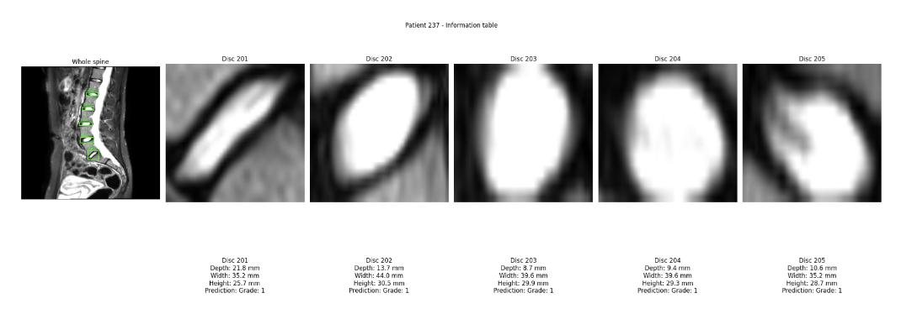
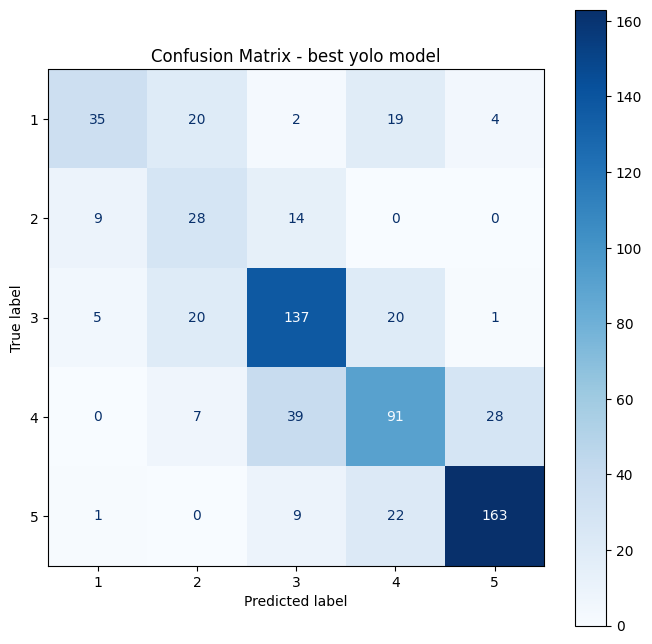

This repository contains an automated pipeline supporting the diagnosis of intervertebral disc degeneration (IDD) from MRI scans, based on the 5-point **Pfirrmann grading system**.

## The Pipeline
Our final script (`final.ipynb`) automates the evaluation process for a selected patient by performing the following steps:
1. The script loads the raw T2-weighted MRI image along with its corresponding ground-truth segmentation mask. Based on the mask, it automatically calculates bounding boxes and crops the individual discs.
2. Using the image's spacing metadata, it calculates the physical dimensions of each disc: depth, width, and height in millimeters.
3. Each cropped disc is passed to a trained YOLO26n-cls model, which predicts its degeneration grade (Grade 1-5).

### Clinical Report Example
Below is an example of the generated report for a patient, showing the localized discs, physical measurements and the YOLO model predictions.

## Models and Results

The models were trained using the public SPIDER dataset (https://zenodo.org/records/10159290). To address class imbalance, we extracted additional slices for the underrepresented grades. We evaluated several architectures (Custom 2D/3D CNNs, ViT-B/16), but the best results were achieved by the lightweight YOLO26n-cls model.

* **Top Accuracy:** 67.4%
* **Strengths:** The model is highly reliable at identifying advanced stages of degeneration (Grades 3 and 5). Most classification errors occur between adjacent grades (e.g. confusing Grade 3 with 4), which is expected given the subtle visual differences in the Pfirrmann scale.

### YOLO26n-cls Confusion Matrix

